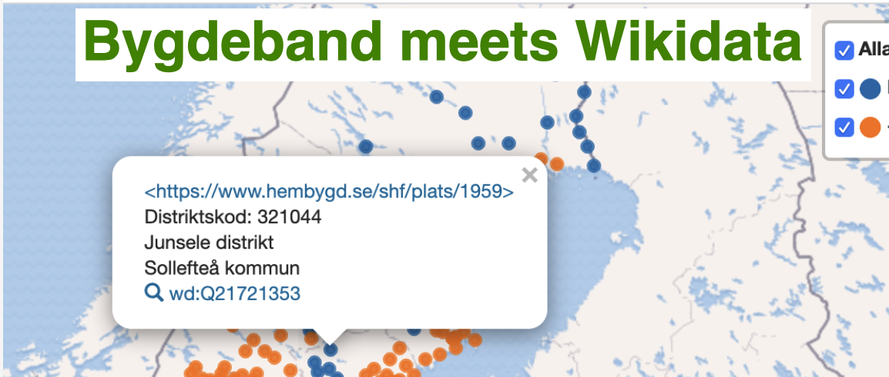

# WikidataBygdeband
Arbetsyta för att städa data et al mellan  Wikidata och Bygdeband. [Bygdeband](https://www.hembygd.se/shf/page/34831) har bytt plattfor till moderna byggstenar som [Leaflet](https://leafletjs.com/) / [Angular](https://angular.io/) --> nya möjligheter... och projektfolk finns på plats... 

Förslag/issues Prio se [Github projektyta](https://github.com/salgo60/WikidataBygdeband/projects/1?fullscreen=true) och [Issues](https://github.com/salgo60/WikidataBygdeband/issues)

Jag skapade även en Telegram grupp [Wikidata/Bygdeband](https://t.me/joinchat/FgDj6BbeSU4B6Kr3xf5JXw) om det är enklare sätt att kommunicera 

Se också 
* [T248875](https://phabricator.wikimedia.org/T248875) "Bygdeband has changed URLS"
* UI API:Search [prototyp Wikipedia sökning distrikt](https://jsfiddle.net/salgo60/0baqun1h/embedded/result/) som ett alternativ att länka direkt till en artikel. Fler liknande [exempel](https://minancestry.blogspot.com/2018/10/nobel-data-api-test.html)
* test Wikipedia [Jälluntofta socken](https://sv.wikipedia.org/wiki/J%C3%A4lluntofta_socken) kopplas till Bygdeband 1304 [Jälluntofta distrikt](https://www.hembygd.se/shf/plats/1304)

Här borde finnas en tanke / ide hur Bygdeband kopplar personer/bilder/platser/byggnader tillbaka till Wikipedia / Wikidata Digitaltmuseum / Europeana / RAÄ / Riksarkivet.... 

Se exempel [karta hur vi kopplar ihop RAÄ böcker](https://goo.gl/Ftkd3F) om kyrkor med Wikidata dom borde kunna synas i Bygdeband [GITHUB SamlaLibris](https://github.com/salgo60/SamlaLibris) där borde museernas bilder om kyrkor synas se även test med Gotlands museum <-> Wikidata [T227736](https://phabricator.wikimedia.org/T227736) där mycket om kyrkor finns men väldigt dålig metadata

Bok om Riddarholms kyrkan som beskriver olika personers gravar där vi kopplar ihop i WIkidata 
* Boken
* Personerna vilkas gravar beskrivs
* Kyrkan
* Författaren

[Wikidata SPARQL fråga](http://tinyurl.com/y334xnvy) hitta personer beskrivna i boken [WD Q61765464](https://www.wikidata.org/wiki/Q61765464?uselang=sv)

* [Video om detta](https://www.youtube.com/watch?v=6szCrwKdji0) ser att vi bör ha samma tankar hur Bygdebandsrörelsen passar ihop med alla oss andra
* [tweet](https://twitter.com/salgo60/status/1247438144494022656?s=20) till Digitaltmuseum Ulf Bodin om han har förslag hur Bygdeband kan kopplas till dom....
* [tweet](https://twitter.com/salgo60/status/1247449028146667522?s=20) Digisam/Nordiska museet
